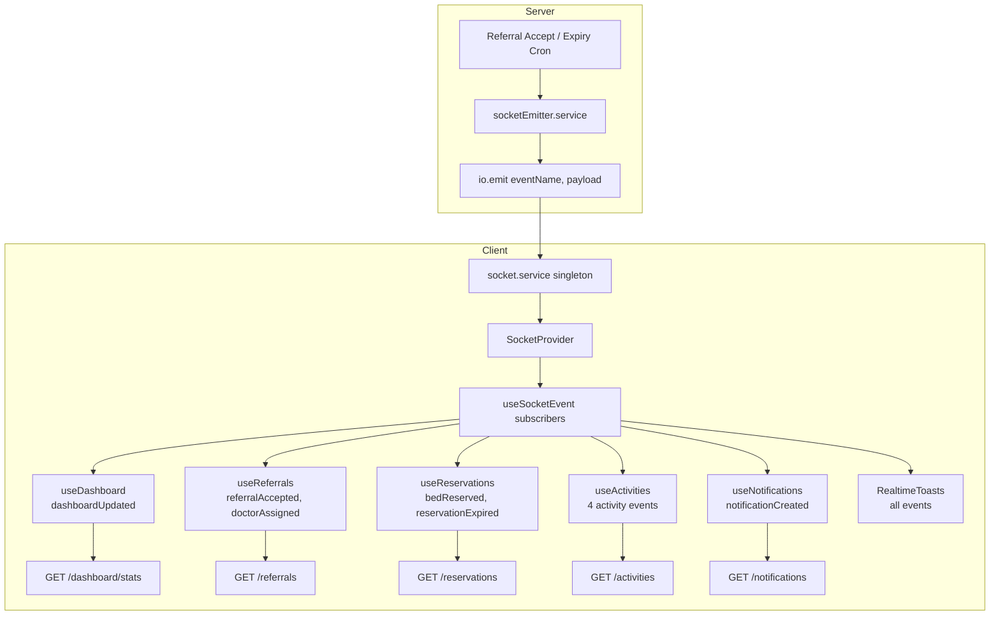

# Phase 8 Completion Report — Notifications + Socket.IO

**Status:** Complete  
**Date:** June 14, 2026

---

## 1. Updated File Tree (client additions)

```
client/src/
├── components/layout/
│   ├── ConnectionStatusIndicator.tsx   # NEW
│   ├── RealtimeToasts.tsx              # NEW
│   └── TopNavbar.tsx                   # MODIFIED
├── context/
│   └── SocketContext.tsx               # NEW
├── features/
│   ├── dashboard/
│   │   ├── components/ActivityFeed.tsx # MODIFIED
│   │   ├── hooks/
│   │   │   ├── useActivities.ts        # NEW
│   │   │   └── useDashboard.ts         # MODIFIED
│   │   ├── services/activity.service.ts # NEW
│   │   ├── types/activity.types.ts     # NEW
│   │   └── utils/activityMappers.ts    # NEW
│   ├── notifications/                  # NEW FEATURE
│   │   ├── components/
│   │   │   ├── NotificationBell.tsx
│   │   │   ├── NotificationDrawer.tsx
│   │   │   └── NotificationsView.tsx
│   │   ├── context/NotificationsContext.tsx
│   │   ├── hooks/useNotifications.ts
│   │   ├── services/notification.service.ts
│   │   ├── types/notification.types.ts
│   │   └── index.ts
│   ├── referrals/hooks/useReferrals.ts # MODIFIED
│   └── reservations/hooks/useReservations.ts # MODIFIED
├── hooks/
│   ├── useDebouncedCallback.ts         # NEW
│   ├── useSocket.ts                    # NEW
│   └── useSocketEvent.ts               # NEW
├── layouts/AppLayout.tsx               # MODIFIED
├── lib/toast.ts                        # MODIFIED (+ showWarningToast)
├── pages/notifications/NotificationsPage.tsx # MODIFIED
├── services/socket.service.ts          # NEW
└── types/socket.ts                     # NEW
```

---

## 2. Files Created

| File | Purpose |
|------|---------|
| `types/socket.ts` | Typed socket event names and payloads |
| `services/socket.service.ts` | Singleton Socket.IO client |
| `context/SocketContext.tsx` | `SocketProvider` with connection lifecycle |
| `hooks/useSocket.ts` | Context accessor |
| `hooks/useSocketEvent.ts` | Event subscription with cleanup |
| `hooks/useDebouncedCallback.ts` | Debounce utility for refetch |
| `components/layout/ConnectionStatusIndicator.tsx` | Navbar connection badge |
| `components/layout/RealtimeToasts.tsx` | Global Sonner toast listeners |
| `features/notifications/*` | Full notifications feature module |
| `features/dashboard/services/activity.service.ts` | Activity API client |
| `features/dashboard/hooks/useActivities.ts` | Activity feed hook |
| `features/dashboard/types/activity.types.ts` | Activity log types |
| `features/dashboard/utils/activityMappers.ts` | ActivityLog → ActivityItem |

---

## 3. Files Modified

| File | Change |
|------|--------|
| `layouts/AppLayout.tsx` | Wraps authenticated shell with `SocketProvider`, `NotificationsProvider`, `RealtimeToasts` |
| `components/layout/TopNavbar.tsx` | Live notification bell + connection indicator |
| `features/dashboard/hooks/useDashboard.ts` | Debounced silent refetch on `dashboardUpdated` |
| `features/dashboard/components/ActivityFeed.tsx` | Live API data + loading/error/empty states |
| `features/referrals/hooks/useReferrals.ts` | Debounced refetch on `referralAccepted`, `doctorAssigned` |
| `features/reservations/hooks/useReservations.ts` | Debounced refetch on `bedReserved`, `reservationExpired` |
| `pages/notifications/NotificationsPage.tsx` | Renders `NotificationsView` |
| `lib/toast.ts` | Added `showWarningToast` |
| `client/package.json` | `socket.io-client` dependency |
| `PROJECT_CONTEXT.md` | Phase 8 documentation |

---

## 4. Architecture Explanation

Phase 8 adds a **realtime layer** on top of the existing feature-based architecture without changing the backend.

**Connection layer:** `socket.service.ts` maintains a singleton Socket.IO client. `SocketProvider` (inside `AppLayout`, only when authenticated) connects on login and disconnects on logout. It tracks `connectionStatus`, `isConnected`, and `lastEvent`.

**Subscription layer:** `useSocketEvent` attaches typed listeners with automatic cleanup on unmount. Handlers use refs to avoid re-subscribing on every render.

**Data layer:** Feature hooks (`useDashboard`, `useReferrals`, `useReservations`, `useActivities`, `useNotifications`) call existing Axios services. Socket events trigger **debounced silent refetches** (500ms) to avoid duplicate API calls and loading-state flicker.

**UI layer:** `NotificationsProvider` centralizes notification state so the bell, drawer, and page share one listener. `RealtimeToasts` provides global Sonner feedback. `ConnectionStatusIndicator` shows unobtrusive connection state in the navbar.

---

## 5. Socket Event Flow Diagram



---

## 6. API Usage Summary

| Endpoint | Method | Feature | Trigger |
|----------|--------|---------|---------|
| `/notifications` | GET | Notifications | Mount + debounced socket refresh |
| `/notifications/:id/read` | PATCH | Notifications | User marks read |
| `/activities` | GET | Activity Feed | Mount + debounced socket refresh |
| `/dashboard/stats` | GET | Dashboard | Mount + `dashboardUpdated` |
| `/referrals` | GET | Referrals | Mount + `referralAccepted`, `doctorAssigned` |
| `/reservations` | GET | Reservations | Mount + `bedReserved`, `reservationExpired` |

All requests use the shared Axios instance with JWT interceptors.

---

## 7. Testing Instructions

### Prerequisites

1. Start MongoDB and the server (`server/` — port 5000)
2. Start the client (`client/` — Vite dev server)
3. Ensure `client/.env` has:
   ```
   VITE_API_URL=http://localhost:5000/api
   VITE_SOCKET_URL=http://localhost:5000
   ```

### Manual test checklist

1. **Connection status**
   - Log in → navbar shows **Connected** (green dot)
   - Stop the server → status changes to **Reconnecting** then **Offline**
   - Restart server → reconnects to **Connected**

2. **Notifications**
   - Click bell icon → drawer opens with notification list
   - Accept a referral → new notification appears instantly + unread badge increments
   - Click notification → marks as read
   - Visit `/notifications` → full page list with mark-all-read

3. **Dashboard realtime**
   - Open dashboard as Super Admin or Hospital Admin
   - Accept a referral in another tab → KPI cards update without page refresh
   - Activity feed refreshes with new log entry

4. **Referrals realtime**
   - Open `/referrals` → accept a referral
   - Table/kanban updates; Sonner toast: "Referral Accepted"

5. **Reservations realtime**
   - Open `/reservations` → accept a referral (creates reservation)
   - Table and KPI cards update; toast: "Bed Reserved"
   - Wait for reservation expiry (cron runs every minute) → toast: "Reservation Expired"

6. **Toasts**
   - Verify Sonner toasts for: referral accepted, doctor assigned, bed reserved, reservation expired, notification received

### Build verification

```bash
cd client && npm run build
```

---

## 8. Screenshot References

Capture these screens after running the app:

| # | Screen | What to verify |
|---|--------|----------------|
| 1 | Top navbar | Green "Connected" indicator + notification bell with badge |
| 2 | Notification drawer | Slide-over list with unread dot, type badges |
| 3 | `/notifications` page | Full notification cards, mark read actions |
| 4 | Dashboard | Live activity feed (no placeholder banner) |
| 5 | Referrals | Updated status after socket event |
| 6 | Reservations | Updated table + summary KPIs after bed event |
| 7 | Toast stack | Sonner notifications top-right on events |

---

## 9. Performance Notes

- Socket listeners cleaned up on unmount via `useSocketEvent`
- Refetches debounced at 500ms to collapse rapid event bursts (referral accept emits 6 events)
- Silent refetch skips loading spinners and error toasts for background updates
- Single `NotificationsProvider` prevents duplicate notification listeners

---

## 10. Known Limitations

- Socket events are broadcast globally (`io.emit`) — no per-user rooms yet
- Acting user receives multiple toasts when accepting a referral (local action + socket events)
- Notification/activity API routes have no auth middleware on the server (pre-existing)

---

**Phase 8 deliverables complete. Phases 1–7 preserved.**
