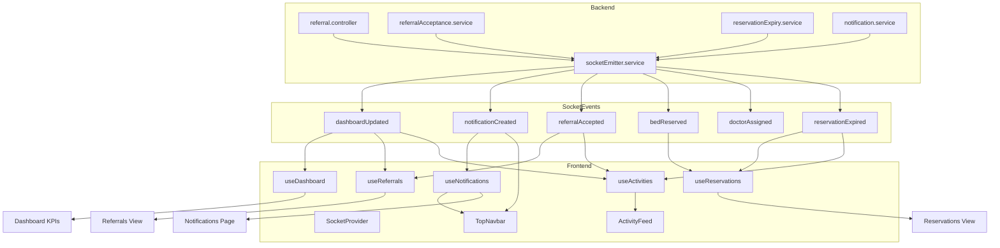

# Phase 8 Readiness Report — Notifications + Socket.IO

> **Purpose:** Pre-implementation analysis for MediBridge Phase 8.  
> **Scope:** Readiness assessment only — no code changes.  
> **Reference:** [PROJECT_CONTEXT.md](./PROJECT_CONTEXT.md)  
> **Date:** June 14, 2026

---

## Executive Summary

The **backend realtime foundation is partially built** — Socket.IO initializes on the HTTP server, a global emitter service broadcasts six event types, and notification/activity persistence exists. The **frontend has zero Socket.IO integration**; notification and activity UIs are placeholders.

Phase 8 is **feasible without a full backend rewrite**, but several **architectural gaps** must be addressed during implementation (or accepted as known limitations):

| Area | Readiness | Notes |
|------|-----------|-------|
| Socket server bootstrap | ✅ Ready | Initialized before cron jobs in `server.js` |
| Event emission | ⚠️ Partial | 6 events defined; reject/complete emit nothing |
| Notification API | ⚠️ Partial | Routes exist; **no auth middleware** |
| Activity API | ⚠️ Partial | Route exists; **no auth middleware** |
| Socket auth / rooms | ❌ Missing | Global `io.emit` to all clients |
| Notification scoping | ❌ Missing | No `userId` on model — system-wide notifications |
| Frontend socket client | ❌ Missing | `socket.io-client` not in `client/package.json` |
| Notifications UI | ❌ Placeholder | `PagePlaceholder` only |
| Activity feed UI | ❌ Placeholder | Static `TEMPORARY_ACTIVITY_DATA` |
| Navbar bell | ⚠️ Stub | Disabled button, hardcoded `0` badge |

**Recommendation:** Proceed with Phase 8 using a **central `SocketProvider`** mounted inside authenticated routes, wiring existing events to **refetch-based updates** (not payload-merge) until backend payloads and scoping mature.

---

## 1. Existing Backend Socket.IO Architecture

### 1.1 Socket Initialization

**File:** `server/src/config/socket.js`  
**Bootstrapped from:** `server/server.js`

```
connectDB()
  → http.createServer(app)
  → initializeSocket(server)   // Socket.IO attached to same HTTP server
  → startReservationExpiryJob()
  → server.listen(PORT)
```

**Behavior:**

- Singleton `io` instance stored in module scope.
- CORS: `origin: "*"`, methods `GET`, `POST`.
- Connection handler logs connect/disconnect only — **no authentication**, **no room joins**, **no custom client events**.
- `getIO()` throws if called before initialization (guards against circular dependency race).

**Implication for Phase 8:** Client connects to `SOCKET_URL` (same host/port as API, no `/api` prefix). Socket path defaults to `/socket.io/`.

---

### 1.2 Emitter Service

**File:** `server/src/services/socketEmitter.service.js`

```javascript
emitEvent(eventName, data) → io.emit(eventName, data)  // broadcast to ALL connected clients
```

**Design characteristics:**

- Lazy-requires `getIO()` to avoid circular imports with `socket.js`.
- Errors are caught and logged; emission failures do not fail HTTP requests.
- All events are **global broadcasts** — no per-user, per-hospital, or per-role targeting.

---

### 1.3 Emitted Events (Complete Inventory)

| Event | Trigger Location | Payload Shape | Also Creates Notification? | Also Logs Activity? |
|-------|------------------|---------------|---------------------------|---------------------|
| `dashboardUpdated` | `referral.controller.js` (create) | `{ action: "REFERRAL_CREATED" }` | ✅ (via separate flow) | ✅ |
| `dashboardUpdated` | `referralAcceptance.service.js` (accept) | `{ action: "REFERRAL_ACCEPTED" }` | ✅ | ✅ |
| `dashboardUpdated` | `referralAcceptance.service.js` (accept) | `{ action: "BED_RESERVED" }` | — | — |
| `dashboardUpdated` | `referralAcceptance.service.js` (accept) | `{ action: "DOCTOR_ASSIGNED" }` | — | — |
| `referralAccepted` | `referralAcceptance.service.js` | `{ referralId, patientName }` | ✅ | ✅ |
| `bedReserved` | `referralAcceptance.service.js` | `{ reservationId, patientName }` | — | — |
| `doctorAssigned` | `referralAcceptance.service.js` | `{ doctorId, doctorName }` | — | — |
| `dashboardUpdated` | `reservationExpiry.service.js` (cron) | `{ action: "RESERVATION_EXPIRED" }` | ✅ | ✅ |
| `reservationExpired` | `reservationExpiry.service.js` | `{ reservationId, patientName }` | ✅ | ✅ |
| `notificationCreated` | `notification.service.js` | `{ title, message, type }` | (source) | — |

**Events NOT emitted today (gaps):**

- Referral **reject** (`rejectReferral` controller) — no socket, notification, or activity
- Referral **complete** (`completeReferral` controller) — no socket, notification, or activity
- Doctor list / hospital capacity changes outside accept/expiry flows

**`dashboardUpdated` semantics:** Payload contains only an `action` string. Clients must **refetch** `GET /dashboard/stats` — no inline KPI deltas.

---

### 1.4 Notification Service Integration

**File:** `server/src/services/notification.service.js`

**Flow:**

1. `Notification.create({ title, message, type })` — persists to MongoDB
2. `emitEvent("notificationCreated", { title, message, type })` — socket broadcast

**Called from:**

| Caller | Notification Content |
|--------|---------------------|
| `referral.controller.js` (create) | `"New Referral"` / patient name / `INFO` |
| `referralAcceptance.service.js` (accept) | `"Referral Accepted"` / patient name / `SUCCESS` |
| `reservationExpiry.service.js` (cron) | `"Reservation Expired"` / patient name / `WARNING` |

**Notification model** (`server/src/models/Notification.js`):

- Fields: `title`, `message`, `type` (`INFO` \| `SUCCESS` \| `WARNING` \| `ERROR`), `isRead` (default `false`), timestamps
- **No `userId`, `hospitalId`, or `role` field** — notifications are system-global

**REST API** (`server/src/controllers/notification.controller.js`):

| Method | Route | Auth | Behavior |
|--------|-------|------|----------|
| `GET` | `/api/notifications` | ❌ None | Returns all notifications, sorted `createdAt` desc |
| `PATCH` | `/api/notifications/:id/read` | ❌ None | Sets `isRead: true` |

**Socket vs REST mismatch:** Socket payload omits `_id`, `isRead`, and `createdAt`. Clients receiving `notificationCreated` cannot mark-read without refetching or generating a temporary ID.

---

### 1.5 Activity Log Integration (Related)

**File:** `server/src/services/activityLogger.service.js`  
**API:** `GET /api/activities` — returns last 100 activity logs, **no auth**

**Logged actions today:**

- `REFERRAL_CREATED`
- `REFERRAL_ACCEPTED`
- `RESERVATION_EXPIRED`

**No socket event** fires when activity is logged. Activity feed updates must be driven by:

- Initial REST fetch, and/or
- Inferring refresh from correlated socket events (`referralAccepted`, `reservationExpired`, `dashboardUpdated`)

---

## 2. Existing Frontend Architecture

### 2.1 App Shell

```
App.tsx
  └── BrowserRouter
        └── AppRoutes (routes/index.tsx)
              └── AuthProvider
                    └── ProtectedRoute
                          └── AppLayout
                                ├── Sidebar
                                ├── TopNavbar
                                └── <Outlet /> (feature pages)
```

**Provider stack today:** `AuthProvider` only. No global state manager (Redux/Zustand). Feature data lives in feature hooks with local `useState`.

**Phase 8 insertion point:** `SocketProvider` should mount **inside `AuthProvider`**, wrapping **`ProtectedRoute` → `AppLayout`** (or inside `AppLayout`) so the socket connects only when authenticated and disconnects on logout.

---

### 2.2 Navbar (`TopNavbar.tsx`)

**Current state:**

- Breadcrumbs (functional)
- Global search input — **disabled placeholder**
- Notification bell — **disabled** `Button`, hardcoded badge `"0"`
- User avatar dropdown — functional (settings link, logout)

**Phase 8 targets:**

- Enable bell → link to `ROUTES.NOTIFICATIONS` or dropdown preview
- Live unread count from `useNotifications`
- Optional toast on `notificationCreated` via `showInfoToast`

---

### 2.3 Dashboard (`DashboardView.tsx`)

**Data flow:**

- `useAuth()` → role check via `supportsDashboardApi()`
- `useDashboard(canFetch)` → `GET /dashboard/stats`
- Renders KPI `StatCard`s, operational metrics, system overview
- Embeds `<ActivityFeed />` at bottom

**Role gating:**

- `SUPER_ADMIN` / `HOSPITAL_ADMIN` → full dashboard with API data
- `REFERRAL_COORDINATOR` / `DOCTOR` → error message, no stats fetch

**Realtime hook point:** `useDashboard` exposes `refetch` — subscribe to `dashboardUpdated` and call `refetch()` when `canFetch === true`.

**Activity feed:** Separate component; currently decoupled from any hook (static data).

---

### 2.4 Notification Placeholder Page

**File:** `client/src/pages/notifications/NotificationsPage.tsx`

- Renders `PagePlaceholder` with Bell icon
- Routed at `/notifications` for all authenticated roles
- Sidebar nav item exists in `navigationConfig`
- **No feature module** under `features/notifications/`

---

### 2.5 Activity Feed Placeholder

**File:** `client/src/features/dashboard/components/ActivityFeed.tsx`

- Static `TEMPORARY_ACTIVITY_DATA` array (5 items)
- Warning banner: *"activity API integration pending (Phase 8)"*
- UI pattern established: icon circle, description, action badge, relative timestamp
- Uses `DashboardSection`, `Badge`
- `ActivityItem` type defined in `dashboard.types.ts` — shape differs from backend `ActivityLog` (backend has `entityType`, `entityId`, `performedBy`, ISO timestamps)

---

## 3. Locations That Should Receive Realtime Updates

### 3.1 Dashboard KPIs

| Component / Hook | Socket Event(s) | Update Strategy |
|------------------|-----------------|-----------------|
| `useDashboard` / `DashboardView` KPI cards | `dashboardUpdated` | Call `refetch()` → `GET /dashboard/stats` |
| Operational / system metric rows | `dashboardUpdated` | Same refetch (derived from stats) |

**Who benefits:** `SUPER_ADMIN`, `HOSPITAL_ADMIN` only (only roles with API access).

**Frequency note:** Accept flow emits **four** `dashboardUpdated` events in rapid succession — implement **debounced refetch** (300–500ms) to avoid API spam.

---

### 3.2 Referrals

| Component / Hook | Socket Event(s) | Update Strategy |
|------------------|-----------------|-----------------|
| `useReferrals` / `ReferralsView` | `referralAccepted`, `dashboardUpdated` (action `REFERRAL_CREATED`) | Call `refetch()` → `GET /referrals` |
| `ReferralKanban` / `ReferralTable` | Same | Re-render from updated list |
| Open `ReferralDetailDrawer` | Same | If selected referral ID matches event `referralId`, refetch or merge status |

**Caveats:**

- Accept action already optimistically updates + refetches in `performAction` — socket refetch is redundant for the acting user but needed for **other connected clients/tabs**
- Reject/complete do not emit events — other users won't see changes until manual refresh unless backend is extended

---

### 3.3 Reservations

| Component / Hook | Socket Event(s) | Update Strategy |
|------------------|-----------------|-----------------|
| `useReservations` / `ReservationsView` | `bedReserved`, `reservationExpired` | Call `refetch()` → `GET /reservations` |
| `ReservationSummaryCards` | Same | Recomputed from reservation list |
| `ExpiryCountdown` | `reservationExpired` | Refetch updates status to `EXPIRED` |
| `useReservationDetail` | `reservationExpired` | If open drawer matches `reservationId`, refetch detail |

**Caveats:**

- Cron-driven expiry fires every minute — clients on Reservations page should refetch on `reservationExpired`
- `bedReserved` fires on accept — new reservation appears after refetch
- **Role mismatch:** Frontend allows `DOCTOR` on `/reservations`; backend `GET /reservations` authorizes only `SUPER_ADMIN` and `HOSPITAL_ADMIN` — doctors will get 403 today

---

### 3.4 Notifications

| Component / Hook | Socket Event(s) | Update Strategy |
|------------------|-----------------|-----------------|
| `TopNavbar` bell badge | `notificationCreated` | Increment unread count or refetch notifications |
| `NotificationsView` (new) | `notificationCreated` | Prepend to list (after refetch for `_id`) or full refetch |
| Mark-as-read action | — (REST) | `PATCH /notifications/:id/read` |

**All authenticated roles** have notifications route access — aligns with global notification model.

---

### 3.5 Activity Feed

| Component / Hook | Socket Event(s) | Update Strategy |
|------------------|-----------------|-----------------|
| `ActivityFeed` | `referralAccepted`, `reservationExpired`, `dashboardUpdated` | Refetch `GET /activities` (debounced) or prepend mapped item |

**Preferred approach:** Refetch activities on relevant events rather than reconstructing activity rows from socket payloads (backend doesn't emit activity-specific events).

**Visibility:** Activity feed renders inside `DashboardView` — only visible to roles that reach the dashboard content. Coordinators/doctors see error state before feed; consider whether activity should appear elsewhere in a future phase.

---

### 3.6 Secondary / Out-of-Scope for Phase 8 (Optional)

| Area | Event | Notes |
|------|-------|-------|
| Doctors directory | `doctorAssigned` | Could refetch doctors — not in Phase 8 spec |
| Hospitals directory | `bedReserved`, `reservationExpired` | Bed counts change — optional |
| Reports | `dashboardUpdated` | Analytics are snapshot-based; realtime not required |

---

## 4. Frontend Realtime Architecture Design

### 4.1 `socket.io-client` Setup

**Dependency:** Add `socket.io-client@^4.8.x` to `client/package.json` (match server Socket.IO major version).

**Connection config** (new `client/src/services/socket.service.ts` or `client/src/lib/socket.ts`):

| Option | Value |
|--------|-------|
| URL | `SOCKET_URL` from `@/lib/constants` (`VITE_SOCKET_URL`) |
| Transports | `["websocket", "polling"]` (default) |
| Auto-connect | `false` — connect manually when auth ready |
| Auth | `auth: { token }` in handshake (future-proof; server doesn't validate yet) |
| Reconnection | Built-in defaults (`reconnection: true`, exponential backoff) |

**Single socket instance** — module-level singleton created by service, not per-component.

---

### 4.2 Provider / Context Strategy

**Recommended:** `SocketProvider` in `client/src/context/SocketContext.tsx`

```
AuthProvider
  └── SocketProvider          ← NEW: connects when token present
        └── ProtectedRoute
              └── AppLayout
                    └── pages / hooks consume socket
```

**Context value:**

```typescript
{
  isConnected: boolean;
  connect: () => void;
  disconnect: () => void;
  subscribe: (event: SocketEventName, handler: Handler) => unsubscribe;
}
```

**Why context over per-feature sockets:**

- Single connection per tab (architecture rule: no duplicate infrastructure)
- Centralized connect/disconnect tied to auth lifecycle
- Feature hooks subscribe without owning connection logic

**Companion hook:** `useSocket()` — throws if used outside provider.

**Optional utility hook:** `useSocketEvent(event, handler, deps)` — wraps subscribe + cleanup in `useEffect`.

---

### 4.3 Event Subscriptions

**Typed event map** (`client/src/types/socket.ts`):

| Event | Payload Type |
|-------|--------------|
| `dashboardUpdated` | `{ action: string }` |
| `notificationCreated` | `{ title: string; message: string; type: NotificationType }` |
| `referralAccepted` | `{ referralId: string; patientName: string }` |
| `bedReserved` | `{ reservationId: string; patientName: string }` |
| `doctorAssigned` | `{ doctorId: string; doctorName: string }` |
| `reservationExpired` | `{ reservationId: string; patientName: string }` |

**Subscription ownership:**

| Hook / Component | Events |
|------------------|--------|
| `useDashboard` | `dashboardUpdated` |
| `useReferrals` | `referralAccepted`, `dashboardUpdated` (filter `REFERRAL_CREATED`) |
| `useReservations` | `bedReserved`, `reservationExpired` |
| `useNotifications` | `notificationCreated` |
| `useActivities` (new) | `referralAccepted`, `reservationExpired`, `dashboardUpdated` |

**Cross-cutting toasts (optional, in provider or `useNotifications`):**

- On `notificationCreated` → `showInfoToast(message)` when user is not on notifications page

---

### 4.4 Cleanup Strategy

| Lifecycle Event | Action |
|-----------------|--------|
| Component unmount | `useSocketEvent` cleanup removes listener via `socket.off(event, handler)` |
| Logout | `disconnect()` — remove all listeners, close connection |
| Token cleared (401) | Same as logout (AuthContext redirect) |
| Provider unmount | Disconnect socket, null singleton |

**Listener discipline:**

- Named handler functions (not inline lambdas) for correct `off()` pairing, OR use `socket.off(event)` sparingly
- Context `subscribe()` returns unsubscribe function — preferred pattern for hooks

---

### 4.5 Reconnect Strategy

**Built-in (socket.io-client):**

- Automatic reconnect with exponential backoff
- `connect` / `disconnect` / `reconnect` lifecycle events

**Application-level on reconnect:**

1. Set `isConnected = true` in context
2. **Refetch stale data** for mounted features:
   - Notifications list + unread count
   - Dashboard stats (if applicable)
   - Referrals list (if on referrals route — or always if hook mounted)
   - Reservations list
   - Activities
3. Optional: `showInfoToast("Reconnected")` — low priority

**On disconnect:**

- Show subtle disconnected indicator in navbar (optional Phase 8.1)
- Do not clear local state — keep last known data visible

**Debounce refetch fan-out:**

- Multiple events in accept flow → single refetch via 300ms debounce keyed by resource type

---

## 5. Reusable Components That Must Be Reused

### From `components/common/`

| Component | Phase 8 Usage |
|-----------|---------------|
| `PageHeader` | Notifications page title + actions |
| `SearchBar` | Optional: filter notifications by message |
| `FilterBar` | Read/unread filter, type filter |
| `EmptyState` | No notifications, activity load error |
| `StatusBadge` | N/A for notifications — use `Badge` with type variants |

### From `components/ui/`

| Component | Phase 8 Usage |
|-----------|---------------|
| `Badge` | Notification type, unread count (navbar), activity action tags |
| `Button` | Mark read, refresh, bell link |
| `Card` | Notification list item container (or list row pattern) |
| `ScrollArea` | Notification list, activity feed scroll |
| `Separator` | List dividers |

### From `components/layout/`

| Component | Phase 8 Usage |
|-----------|---------------|
| `TopNavbar` | Wire bell — extend, do not duplicate |
| `Sidebar` | No changes required (nav link exists) |

### From feature modules

| Component | Phase 8 Usage |
|-----------|---------------|
| `DashboardSection` | Activity feed wrapper (keep) |
| `DashboardSkeleton` / error/empty | Pattern reference for notifications skeleton |
| Feature `*Skeleton` patterns | `NotificationsSkeleton` matching existing style |

### From `lib/`

| Module | Phase 8 Usage |
|--------|---------------|
| `constants.ts` | `SOCKET_URL`, notification type enums (extend if needed) |
| `routes.ts` | `ROUTES.NOTIFICATIONS` |
| `toast.ts` | `showInfoToast`, `showSuccessToast`, `showErrorToast` |

### From `services/`

| Module | Phase 8 Usage |
|--------|---------------|
| `api.ts` | Notification + activity REST calls — do not create alternate HTTP client |

**Do NOT create:**

- Duplicate bell component outside `TopNavbar` (extract `NotificationBell` only if `TopNavbar` grows too large — single source)
- Duplicate badge/status chips — extend `Badge` variants
- Mock notification data — wire real API per architecture rules

---

## 6. Files That Will Be Created

### Core realtime infrastructure

| File | Purpose |
|------|---------|
| `client/src/types/socket.ts` | Socket event names + payload interfaces |
| `client/src/services/socket.service.ts` | Singleton socket factory, connect/disconnect |
| `client/src/context/SocketContext.tsx` | Provider, connection lifecycle, subscribe API |
| `client/src/hooks/useSocket.ts` | Context consumer hook |
| `client/src/hooks/useSocketEvent.ts` | Declarative event subscription hook |

### Notifications feature module

| File | Purpose |
|------|---------|
| `client/src/features/notifications/types/notification.types.ts` | `Notification`, API response types |
| `client/src/features/notifications/services/notification.service.ts` | `getAll`, `markAsRead` |
| `client/src/features/notifications/hooks/useNotifications.ts` | Fetch, unread count, mark read, socket refresh |
| `client/src/features/notifications/utils/notificationUtils.ts` | Unread count, sort, filter helpers |
| `client/src/features/notifications/components/NotificationsView.tsx` | Main list view |
| `client/src/features/notifications/components/NotificationItem.tsx` | Single notification row |
| `client/src/features/notifications/components/NotificationsSkeleton.tsx` | Loading state |
| `client/src/features/notifications/index.ts` | Barrel exports |

### Activity feed integration

| File | Purpose |
|------|---------|
| `client/src/features/activity/types/activity.types.ts` | Backend `ActivityLog` shape |
| `client/src/features/activity/services/activity.service.ts` | `GET /activities` |
| `client/src/features/activity/hooks/useActivities.ts` | Fetch + socket-driven refetch |
| `client/src/features/activity/utils/activityMappers.ts` | Map API → `ActivityItem` for UI |
| `client/src/features/activity/index.ts` | Barrel exports |

### Optional extractions

| File | Purpose |
|------|---------|
| `client/src/components/layout/NotificationBell.tsx` | Bell + badge (if TopNavbar refactor warranted) |

**Estimated new files:** 16–17

---

## 7. Files That Will Be Modified

### Configuration & entry

| File | Change |
|------|--------|
| `client/package.json` | Add `socket.io-client` dependency |

### Routing & providers

| File | Change |
|------|--------|
| `client/src/routes/index.tsx` | Wrap authenticated routes with `SocketProvider` |

### Layout & navbar

| File | Change |
|------|--------|
| `client/src/components/layout/TopNavbar.tsx` | Enable bell, unread badge, link to notifications |

### Pages

| File | Change |
|------|--------|
| `client/src/pages/notifications/NotificationsPage.tsx` | Replace placeholder with `NotificationsView` |

### Dashboard & activity

| File | Change |
|------|--------|
| `client/src/features/dashboard/components/ActivityFeed.tsx` | Remove static data; consume `useActivities` |
| `client/src/features/dashboard/hooks/useDashboard.ts` | Subscribe to `dashboardUpdated`, debounced refetch |
| `client/src/features/dashboard/types/dashboard.types.ts` | Optionally move `ActivityItem` to activity feature |
| `client/src/features/dashboard/index.ts` | Export updates if needed |

### Referrals & reservations

| File | Change |
|------|--------|
| `client/src/features/referrals/hooks/useReferrals.ts` | Subscribe to `referralAccepted` / `dashboardUpdated` |
| `client/src/features/reservations/hooks/useReservations.ts` | Subscribe to `bedReserved` / `reservationExpired` |
| `client/src/features/reservations/hooks/useReservationDetail.ts` | Optional: refetch open detail on matching expiry event |

### Auth integration

| File | Change |
|------|--------|
| `client/src/context/AuthContext.tsx` | Optional: expose logout callback registration for socket teardown (or handle in SocketProvider via `useAuth` watch) |

### Documentation (post-implementation)

| File | Change |
|------|--------|
| `PROJECT_CONTEXT.md` | Update completed features, connected endpoints, folder structure |

### Backend files likely needing modification (not frontend-only)

These are **not** strictly frontend files but may be required for production-quality Phase 8:

| File | Change |
|------|--------|
| `server/src/routes/notification.routes.js` | Add `authenticateUser` middleware |
| `server/src/routes/activity.routes.js` | Add `authenticateUser` middleware |
| `server/src/services/notification.service.js` | Include `_id`, `isRead`, `createdAt` in socket payload |
| `server/src/config/socket.js` | Optional: JWT handshake validation, room joins |
| `server/src/controllers/referral.controller.js` | Optional: emit on reject/complete |

---

## 8. Risks Before Implementation

### Critical

| # | Risk | Impact | Mitigation |
|---|------|--------|------------|
| R1 | **No socket authentication** | Any client can connect and receive all events | Pass JWT in handshake; add server middleware in Phase 8 or document as known dev limitation |
| R2 | **Global `io.emit`** | All users receive all events regardless of role/hospital | Phase 8: refetch endpoints (already role-filtered); future: rooms per hospital/role |
| R3 | **Notification API unauthenticated** | Unauthenticated reads/writes of all notifications | Add auth middleware before wiring frontend |
| R4 | **Activity API unauthenticated** | Activity log exposed publicly | Add auth middleware |
| R5 | **Socket payload missing notification `_id`** | Cannot mark-read realtime notification without refetch | Refetch on `notificationCreated`, or fix backend payload |

### High

| # | Risk | Impact | Mitigation |
|---|------|--------|------------|
| R6 | **Event burst on accept** | 4× `dashboardUpdated` + 3 domain events → API thrashing | Debounce refetch per resource |
| R7 | **Reject/complete don't emit** | Multi-user referral views stale after reject/complete | Extend backend emits, or document as limitation |
| R8 | **DOCTOR role on reservations UI vs 403 API** | Doctors see reservations page but API fails | Fix backend authorization or remove doctor from route (pre-existing bug) |
| R9 | **Double refetch on own actions** | User accepts referral → optimistic update + performAction refetch + socket refetch | Accept redundant refetch; debounce socket handler |
| R10 | **ActivityItem type mismatch** | Backend uses `entityType`/`createdAt`; UI expects `type`/`timestamp` string | Mapper in `activityMappers.ts` |

### Medium

| # | Risk | Impact | Mitigation |
|---|------|--------|------------|
| R11 | **No user-scoped notifications** | All users see identical notification list | Accept for Phase 8 MVP; plan `userId` field later |
| R12 | **CORS `origin: *` on socket** | Fine for dev; production may need restriction | Configure from env in deployment phase |
| R13 | **Memory leaks from listeners** | Duplicate handlers if subscribe called incorrectly | Enforce unsubscribe pattern in `useSocketEvent` |
| R14 | **Tab duplication** | Multiple tabs = multiple socket connections | Acceptable; each tab refetches independently |
| R15 | **Cron expiry while offline** | Missed socket events | Refetch on reconnect + on mount |

### Low

| # | Risk | Impact | Mitigation |
|---|------|--------|------------|
| R16 | **Version skew socket.io** | Client/server major version mismatch | Pin matching versions |
| R17 | **VITE_SOCKET_URL misconfiguration** | Silent connection failures | Connection error state in context + console warn |
| R18 | **Activity feed only on admin dashboard** | Coordinators don't see activity | Out of Phase 8 scope; note in docs |

---

## 9. Detailed Implementation Plan

### Phase 8.0 — Prerequisites & Backend Hardening (Recommended First)

**Goal:** Secure APIs and improve payloads before frontend wiring.

| Step | Task | Files |
|------|------|-------|
| 8.0.1 | Add `authenticateUser` to notification routes | `notification.routes.js` |
| 8.0.2 | Add `authenticateUser` to activity routes | `activity.routes.js` |
| 8.0.3 | Emit full notification object on socket (include `_id`, `isRead`, `createdAt`) | `notification.service.js` |
| 8.0.4 | (Optional) Emit socket events on reject/complete | `referral.controller.js` |
| 8.0.5 | (Optional) Socket JWT auth middleware | `socket.js` |

**Exit criteria:** Authenticated REST calls return data; socket payloads sufficient for UI.

---

### Phase 8.1 — Socket Infrastructure

**Goal:** Client connects/disconnects with auth lifecycle.

| Step | Task | Files |
|------|------|-------|
| 8.1.1 | Add `socket.io-client` to client dependencies | `client/package.json` |
| 8.1.2 | Define socket event types | `types/socket.ts` |
| 8.1.3 | Create socket singleton service | `services/socket.service.ts` |
| 8.1.4 | Implement `SocketProvider` + `useSocket` + `useSocketEvent` | `context/SocketContext.tsx`, `hooks/` |
| 8.1.5 | Mount provider in authenticated route tree | `routes/index.tsx` |
| 8.1.6 | Verify connect on login, disconnect on logout | manual test |

**Exit criteria:** DevTools shows WebSocket connection when logged in; disconnects on logout.

---

### Phase 8.2 — Notifications Feature

**Goal:** Replace placeholder with live notification center + navbar badge.

| Step | Task | Files |
|------|------|-------|
| 8.2.1 | Create notification types + service | `features/notifications/types`, `services` |
| 8.2.2 | Implement `useNotifications` (fetch, unread, mark read) | `hooks/useNotifications.ts` |
| 8.2.3 | Subscribe to `notificationCreated` → refetch or prepend | `useNotifications.ts` |
| 8.2.4 | Build `NotificationsView` + `NotificationItem` + skeleton | `features/notifications/components/` |
| 8.2.5 | Replace `NotificationsPage` placeholder | `pages/notifications/NotificationsPage.tsx` |
| 8.2.6 | Wire `TopNavbar` bell (count, link, enabled state) | `TopNavbar.tsx` |
| 8.2.7 | Optional: toast on new notification | `useNotifications` or provider |

**Exit criteria:** Creating/accepting referral increments bell count; mark-read persists; list matches REST.

---

### Phase 8.3 — Activity Feed

**Goal:** Replace static dashboard activity data with live API.

| Step | Task | Files |
|------|------|-------|
| 8.3.1 | Create activity types + service | `features/activity/` |
| 8.3.2 | Implement `activityMappers.ts` (API → UI `ActivityItem`) | `utils/activityMappers.ts` |
| 8.3.3 | Implement `useActivities` with socket-driven debounced refetch | `hooks/useActivities.ts` |
| 8.3.4 | Refactor `ActivityFeed` to use hook; remove static data + banner | `ActivityFeed.tsx` |
| 8.3.5 | Add loading/error/empty states | `ActivityFeed.tsx` |

**Exit criteria:** Dashboard activity reflects real logs; updates after accept/expiry without page reload.

---

### Phase 8.4 — Realtime Data Refresh (Dashboard, Referrals, Reservations)

**Goal:** Cross-feature live updates via socket subscriptions.

| Step | Task | Files |
|------|------|-------|
| 8.4.1 | Add debounced `dashboardUpdated` handler in `useDashboard` | `useDashboard.ts` |
| 8.4.2 | Add referral event handlers in `useReferrals` | `useReferrals.ts` |
| 8.4.3 | Add reservation event handlers in `useReservations` | `useReservations.ts` |
| 8.4.4 | Optional: `useReservationDetail` expiry sync | `useReservationDetail.ts` |
| 8.4.5 | Implement shared debounce utility (if not inline) | `lib/` or `hooks/useDebouncedCallback.ts` |

**Exit criteria:** Two browser sessions — action in session A updates session B within seconds.

---

### Phase 8.5 — Reconnect & Polish

**Goal:** Resilient behavior and UX completeness.

| Step | Task | Files |
|------|------|-------|
| 8.5.1 | On socket `connect` / `reconnect` — refetch mounted resources | `SocketContext.tsx` |
| 8.5.2 | Connection status indicator (optional dot in navbar) | `TopNavbar.tsx` |
| 8.5.3 | Error boundary for socket failures (graceful degrade to REST-only) | context or layout |
| 8.5.4 | Manual QA matrix by role | — |
| 8.5.5 | Update `PROJECT_CONTEXT.md` | docs |

---

### Testing Matrix (Manual QA)

| Scenario | Roles | Expected |
|----------|-------|----------|
| Login | All | Socket connects |
| Logout | All | Socket disconnects |
| Accept referral (tab A → tab B) | Coordinator | Tab B referrals + dashboard refresh |
| Reservation expiry (wait 60s+) | Hospital Admin | Reservations show EXPIRED |
| New notification | All | Bell count increases |
| Mark notification read | All | Count decrements, persists on refresh |
| Activity feed | Super Admin, Hospital Admin | Shows real logs, updates live |
| Doctor on dashboard | Doctor | No KPI fetch; no socket errors in console |
| API 401 | All | Socket disconnects, redirect login |

---

### Suggested Implementation Order (Summary)

```
8.0 Backend hardening (auth + payloads)
  ↓
8.1 Socket client + provider
  ↓
8.2 Notifications (highest user-visible value)
  ↓
8.3 Activity feed (dashboard completion)
  ↓
8.4 Cross-feature refetch subscriptions
  ↓
8.5 Reconnect polish + documentation
```

---

### Out of Scope for Phase 8 (Future Phases)

- User-scoped / hospital-scoped notifications
- Socket rooms and targeted emits
- Push notifications (browser Notification API)
- Settings page implementation
- Reports realtime refresh
- Doctor dashboard API wiring (`GET /doctor-dashboard`)
- Global navbar search

---

## Appendix A — Event → UI Mapping Diagram



---

## Appendix B — Current vs Target Frontend Stack

| Layer | Current | After Phase 8 |
|-------|---------|---------------|
| Providers | `AuthProvider` | `AuthProvider` → `SocketProvider` |
| HTTP | Axios (`api.ts`) | Unchanged |
| Realtime | None | `socket.io-client` via context |
| Notifications | Placeholder page | Full feature module + navbar |
| Activity | Static array | REST + socket refetch |
| Dashboard | REST on mount | REST on mount + socket refetch |
| Referrals | REST on mount + optimistic actions | + socket refetch for remote updates |
| Reservations | REST on mount | + socket refetch on reserve/expiry |

---

*End of Phase 8 Readiness Report.*
